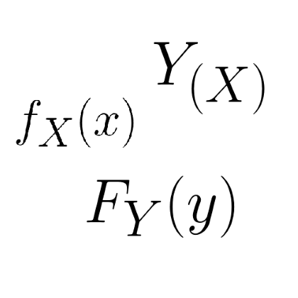

# :chart_with_upwards_trend: Graficador de Funciones de VAs 

</img>

En construccion. Utiliza componentes de [Ionic Framework](https://ionicframework.com/), la libreria [function-plot](https://mauriciopoppe.github.io/function-plot/) para graficos y [MathJax](https://www.mathjax.org/) para renderizar ecuaciones al estilo LaTex.

## Licencia
Ver [aqui](https://github.com/Franco-Giordano/graph-test/blob/master/LICENSE.txt), licencia MIT.
